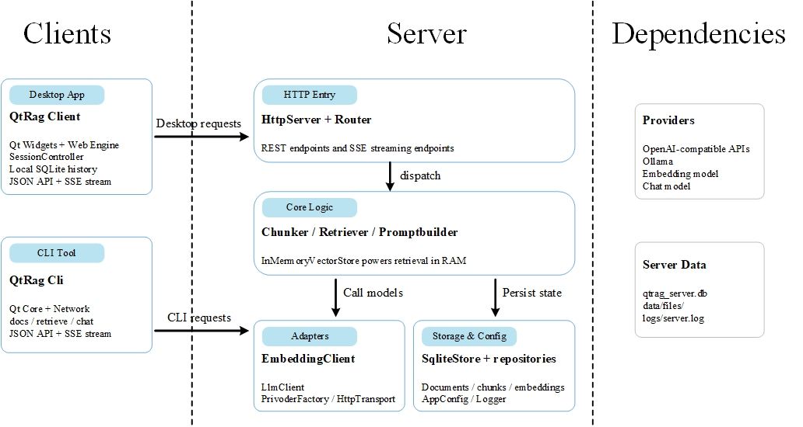

# QtRag

`QtRag` 是一个用 C++ 实现的本地 RAG 工程，当前由 3 个可执行目标组成：

- `QtRagClient`：基于 Qt Widgets + WebEngine 的桌面客户端
- `QtRagCli`：基于 Qt Core + Network 的命令行客户端
- `QtRagServer`：基于 Boost.Beast + SQLite 的 HTTP 服务端

它覆盖了一条完整但仍然轻量的链路：文档导入、切片、向量化、检索、对话生成、SSE 流式返回，以及客户端本地会话持久化。

## 架构图



## 当前项目结构

```text
QtRag/
├── client/                  # 桌面客户端
│   ├── assets/              # 图标等静态资源
│   └── src/
│       ├── controllers/     # 会话编排
│       ├── models/          # 客户端记录模型
│       ├── storage/         # SQLite 与 repository
│       └── ui/              # MainWindow / 页面 / 样式
├── cli/                     # 命令行客户端
│   └── src/
├── server/                  # 服务端
│   ├── config/              # 示例配置
│   └── src/
│       ├── adapters/        # LLM / Embedding / HTTP 适配
│       ├── config/          # 配置加载
│       ├── core/            # chunker / retriever / prompt builder / vector store
│       ├── http/            # HTTP server / router / SSE
│       ├── models/          # 服务端记录模型
│       ├── storage/         # SQLite 与 repository
│       └── utils/           # 日志等公共能力
├── docs/
│   └── assets/
│       └── qtrag-architecture.svg
├── CMakeLists.txt
└── README.md
```

## 架构说明

### 1. Client

- UI 主体在 `client/src/ui/`，核心窗口是 `MainWindow`
- 聊天区使用 `QWebEngineView` 承载消息渲染
- `SessionController` 负责会话创建、消息保存、标题生成
- 客户端本地数据保存在 SQLite：会话、消息、设置、文档元信息
- 通过 `QNetworkAccessManager` 调用服务端 JSON 接口和 SSE 流式接口

### 2. CLI

- 入口在 `cli/src/main.cpp`
- 复用 Qt Network 发起请求
- 支持普通请求和 `/api/v1/chat/stream` 的 SSE 消费
- 适合做脚本调用、压测、接口排查

### 3. Server

- `server/src/main.cpp` 完成启动编排
- `http/` 层负责路由注册、请求分发、JSON 响应、SSE 输出
- `core/` 层负责文本切片、召回、提示词构造、内存向量索引
- `adapters/` 层负责 embedding/llm 请求和上游 provider 适配
- `storage/` 层负责 SQLite schema 与 repository
- 启动时会从 SQLite 中恢复向量索引到内存

### 4. 外部依赖

- Embedding 与 LLM 当前通过 provider 配置接入
- 已实现 OpenAI 兼容接口与 Ollama 这两类上游
- 服务端可选链接 OpenSSL，用于 HTTPS 上游请求

## 启动与请求流

### 服务端启动流

1. 读取配置文件
2. 打开 `qtrag_server.db`
3. 初始化数据库 schema
4. 构造 `HttpServer`
5. 从持久化数据恢复内存向量索引
6. 开始监听 HTTP 请求

### 一次聊天请求的主链路

1. `QtRagClient` 或 `QtRagCli` 发送问题到 `/api/v1/chat` 或 `/api/v1/chat/stream`
2. `HttpServer` 解析请求并分发到对应 handler
3. `Retriever` 在内存向量索引中召回相关 chunk
4. `PromptBuilder` 将问题与检索上下文拼接成 prompt
5. `LlmClient` 通过 provider 调用上游模型
6. 服务端返回完整回答或 SSE token 流
7. Client/CLI 渲染回答，并在客户端本地落库

### 文档入库流

1. 上传文本到 `/api/v1/docs/upload`
2. 服务端保存原始文件并写入文档记录
3. `Chunker` 执行切片
4. `EmbeddingClient` 为 chunk 生成向量
5. 向量与 chunk 元信息写入 SQLite
6. `InMemoryVectorStore` 更新内存索引

## 当前接口

- `GET /health`
- `GET /api/v1/docs`
- `GET /api/v1/models`
- `POST /api/v1/docs/upload`
- `POST /api/v1/docs/remove`
- `POST /api/v1/retrieve`
- `POST /api/v1/chat`
- `POST /api/v1/chat/stream`
- `POST /api/v1/embeddings/regenerate`

## 构建依赖

### 通用

- CMake `>= 3.16`
- 支持 C++17 的编译器

### Client

- Qt Widgets
- Qt Sql
- Qt Network
- Qt WebEngineWidgets

### CLI

- Qt Core
- Qt Network

### Server

- Boost `system`
- Threads
- SQLite3
- `nlohmann_json`
- OpenSSL 可选

## 构建

在仓库根目录执行：

```bash
cmake -S . -B build
cmake --build build -j
```

默认会生成：

- `build/client/QtRagClient`
- `build/cli/QtRagCli`
- `build/server/QtRagServer`

如果你使用已有的 IDE 构建目录，也可以直接指定目标：

```bash
cmake --build build --target QtRagClient -j
cmake --build build --target QtRagCli -j
cmake --build build --target QtRagServer -j
```

## 配置

配置示例位于 `server/config/`：

- `server/config/config.json`
- `server/config/config.openai.example.json`
- `server/config/config.siliconflow.example.json`

当前代码里，`server/src/main.cpp` 固定读取的是：

```cpp
AppConfig::load_from_file("config/config.openai.example.json");
```

这意味着：

- 服务端不会自动读取 `server/config/config.json`
- 运行时当前工作目录里必须存在 `config/config.openai.example.json`

最直接的做法是从 `server/` 目录启动服务端，或者自行修改 `server/src/main.cpp` 中的配置路径。

常用配置项包括：

- `server.listen_address`
- `server.listen_port`
- `server.worker_threads`
- `provider.type`
- `provider.base_url`
- `provider.timeout_ms`
- `models.embedding`
- `llm_options`

## 运行

### 1. 设置上游密钥

OpenAI 兼容上游示例：

```bash
export OPENAI_API_KEY="your_api_key"
```

SiliconFlow 示例：

```bash
export SILICONFLOW_API_KEY="your_api_key"
```

### 2. 启动服务端

推荐从 `server/` 目录启动，避免相对配置路径失效：

```bash
cd server
../build/server/QtRagServer
```

运行产物通常会出现在当前工作目录下：

- `qtrag_server.db`
- `logs/server.log`
- `data/files/`

### 3. 启动桌面客户端

```bash
cd client
../build/client/QtRagClient
```

客户端本地 SQLite 默认也写在当前工作目录，例如：

- `qtrag_client.db`

### 4. 使用 CLI

```bash
./build/cli/QtRagCli health
./build/cli/QtRagCli models
./build/cli/QtRagCli docs list
./build/cli/QtRagCli docs upload README.md --filename README.md
./build/cli/QtRagCli retrieve "这个项目的架构是什么" --top-k 5
./build/cli/QtRagCli chat "请总结一下当前知识库"
./build/cli/QtRagCli chat "请流式回答" --stream
```

CLI 默认服务端地址为 `http://127.0.0.1:8080`，也可以通过 `--server` 覆盖。